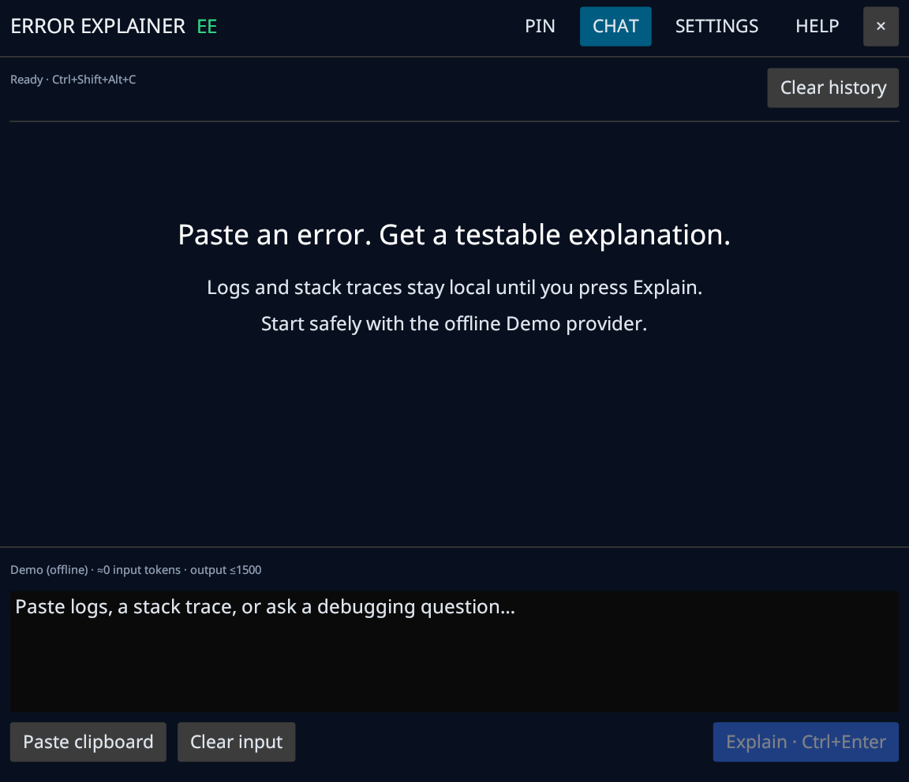
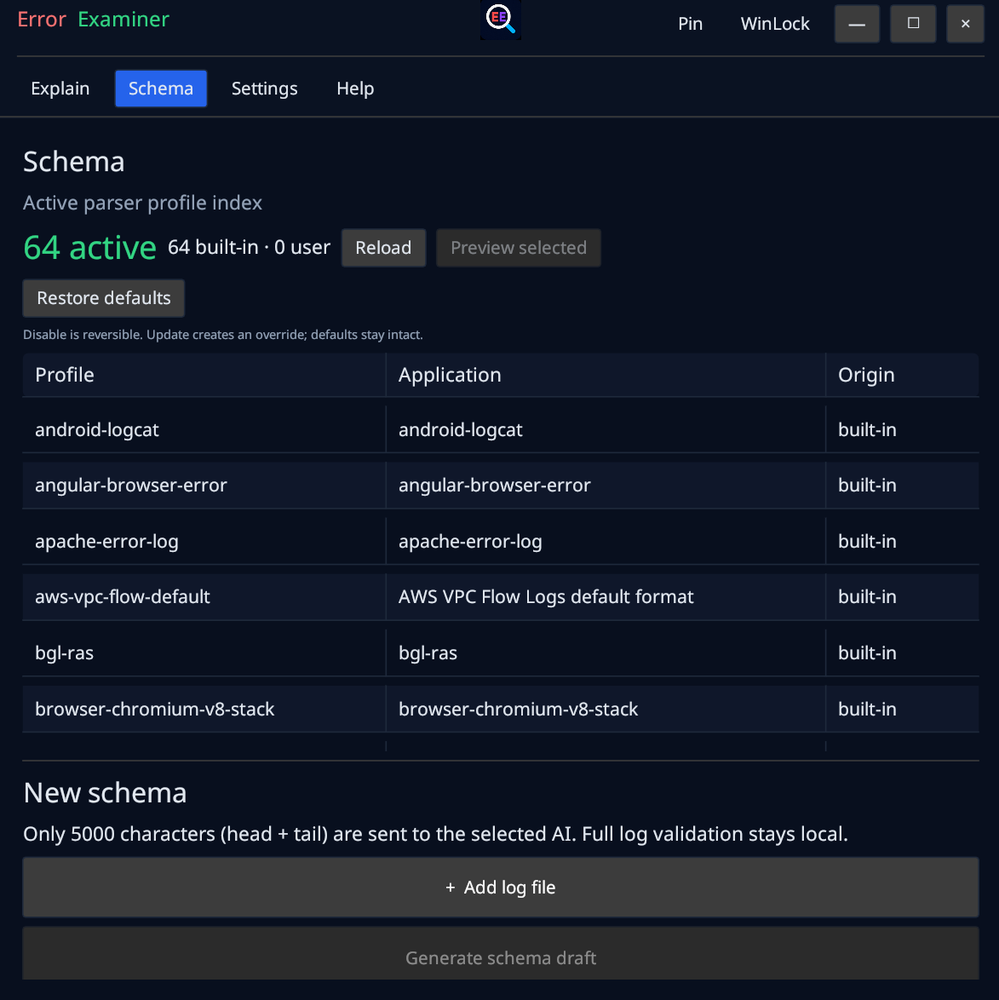
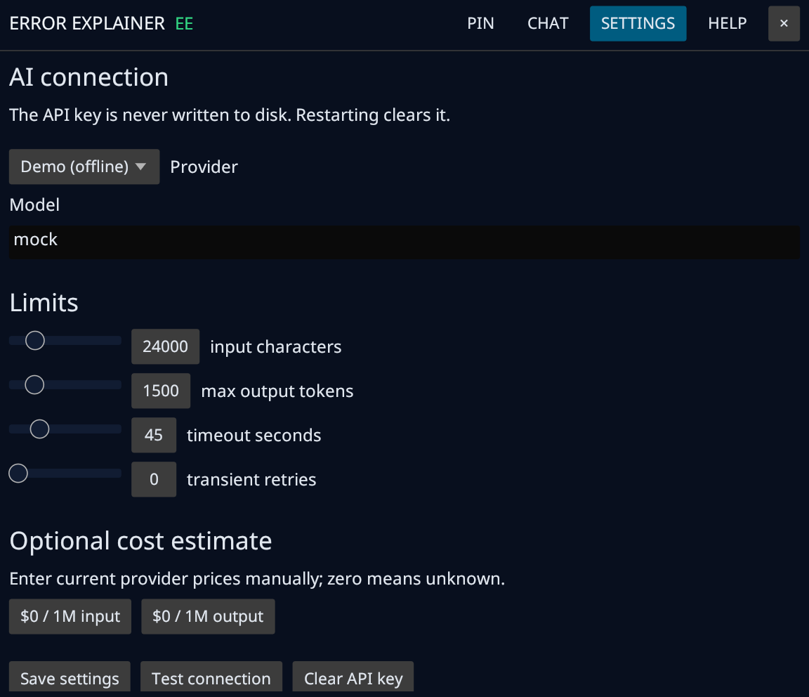
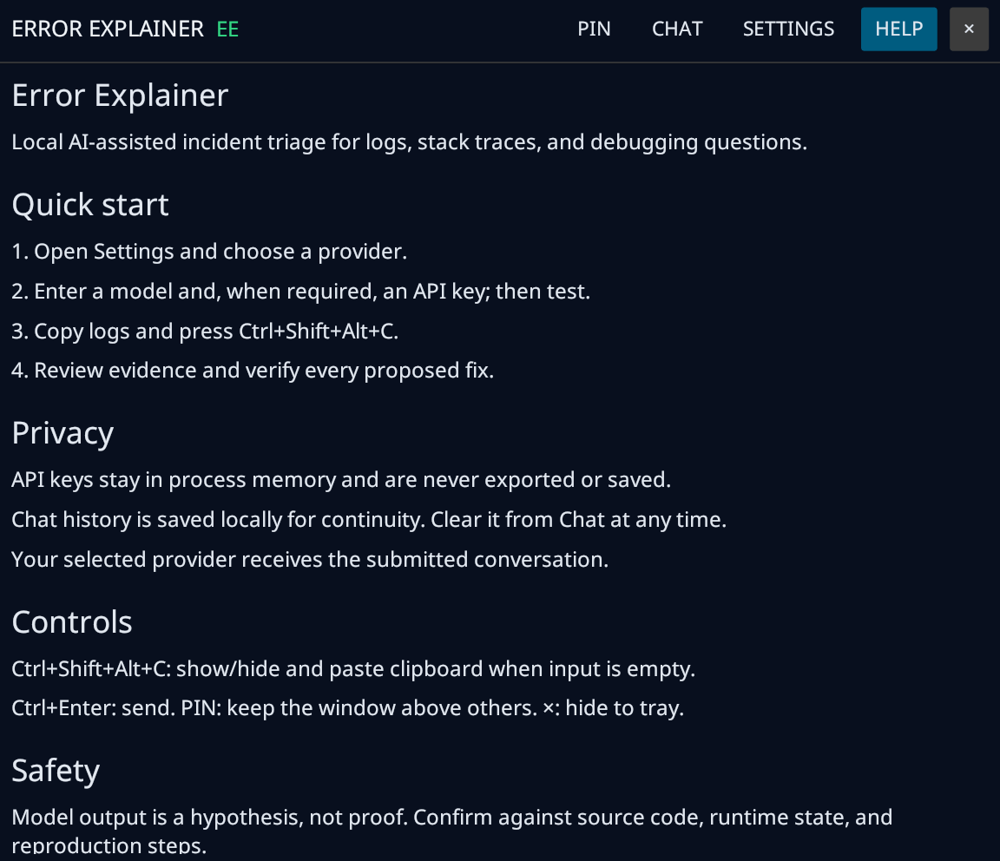

# Error Examiner

**Semantic log preprocessing and AI-assisted error triage**

Error Examiner is a local tray application for logs, stack traces, compiler
output, and debugging questions. It removes repeated noise, preserves useful
diagnostic evidence, and sends bounded requests to the AI provider you choose.

## Download

<p align="center">
  <a href="https://github.com/Freeman4848/Error-Examiner/releases/download/v0.1.0/Error-Examiner-Windows-x86_64.zip">
    
  </a>
</p>

<p align="center">
  <a href="https://github.com/Freeman4848/Error-Examiner/releases/download/v0.1.0/Error-Examiner-Linux-x86_64.tar.gz">
    
  </a>
</p>

**Windows 10/11 x86_64 and Linux x86_64 · v0.1.0**

## Screenshots

### Chat and prepared-log workflow



### Extensible parser schema index



### Provider and privacy settings



### Built-in help



## Features

- Raw/Parsed comparison sends the smaller safe representation.
- Format-aware parsing, deduplication, redaction, token estimates, and batching.
- 57 parser formats with Raw fallback for unknown input.
- OpenAI, Cerebras, LM Studio, Gemini, Anthropic, and custom compatible APIs.
- Local named chat tabs, timestamps, file previews, and image attachments.
- One process owns the resizable window and tray icon.
- `Ctrl+Shift+Alt+C` shows or hides the window and pastes the clipboard.
- API keys remain in process memory and disappear when the application exits.

## Quick Start

### Windows 10/11 x64

1. Download and extract `Error-Examiner-Windows-x86_64.zip`.
2. Run `Error-Examiner.exe`.
3. Optionally run `Create Desktop Shortcut.cmd`.

No installer is required.

### Linux x86_64

1. Extract `Error-Examiner-Linux-x86_64.tar.gz`.
2. Run `error-examiner` directly or install its menu entry:

```bash
tar -xzf Error-Examiner-Linux-x86_64.tar.gz
cd Error-Examiner-Linux-x86_64
./error-examiner
```

Optional local installation:

```bash
bash install-linux.sh
```

The tray requires StatusNotifier/AppIndicator support.

## Provider Setup

Open **Settings**, select a provider, enter its current model ID and API key
when required, then use **Test connection**. LM Studio uses its local REST API
at `http://localhost:1234`; leave Model empty to detect the loaded model.

## Log Preparation

Use **Add log or image** to attach input. Before sending, Error Examiner can
identify the format, redact common secrets, remove duplicates, preserve error
events, split large input into batches, and preview Raw versus Parsed output.
If parsing is unknown or increases size, Raw is retained.

## Privacy and Safety

- Nothing is submitted until you press **Explain**.
- Only the selected provider receives the bounded conversation.
- API keys are never saved to settings, history, logs, screenshots, or exports.
- Chat history is stored locally and can be cleared from the application.
- Logs may contain secrets; inspect previews before sending.
- Model conclusions are hypotheses and must be verified.

## MCP Development Preview

The repository contains a local stdio MCP server using the same parser. It
supports bounded `path` or inline `text` input and `auto`, `raw`, `parsed`, and
`compare` modes. MCP packaging follows the dedicated agent stress test; see
[`docs/mcp-contract.md`](docs/mcp-contract.md).

## Build from Source

```bash
cargo test -j 2
cargo build --release --bin error-examiner -j 2
```

Windows release builds use the MSVC target on `windows-latest`. Linux requires
the GTK/AppIndicator development libraries listed in the build workflow.

Bug reports: `freeman4848.dev@gmail.com`

## License

MIT. See [`LICENSE`](LICENSE). Bundled Noto Sans files retain their upstream
license in `third_party/Noto-Sans-COPYRIGHT`.
